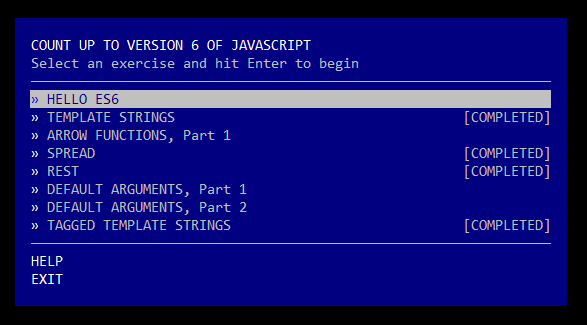

# Count Up to Version 6 of JavaScript!

**An intro to some ES6 features via a set of self-guided workshops.**



Count-to-6 will run you through a series of exercises that introduce you to some of the simpler features of ECMAScript 6, the upcoming revision to the JavaScript language. It leverages the excellent [Traceur compiler](https://github.com/google/traceur-compiler/) to allow you to write code with ES6 syntax, today.

Our coverage so far is pretty minor, but it's growing over time. Check out the issues list for upcoming plans.

## How to Play

First install [Node.js](http://nodejs.org/). Make sure it's a recent version, in the 0.10 range.

Now do:

```
npm install -g count-to-6
```

And get started by typing `count-to-6`!
